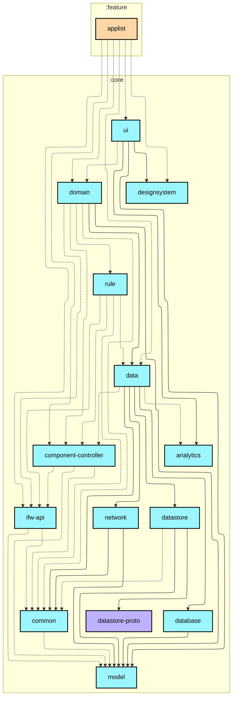
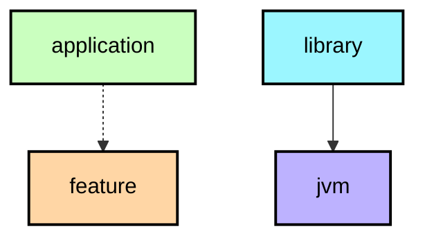

# `:feature:applist`

## Module dependency graph

<!--region graph-->

```mermaid
---
config:
  layout: elk
  elk:
    nodePlacementStrategy: SIMPLE
---
graph TB
  subgraph :feature
    direction TB
    :feature:applist[applist]:::android-feature
  end
  subgraph :core
    direction TB
    :core:analytics[analytics]:::android-library
    :core:common[common]:::android-library
    :core:component-controller[component-controller]:::android-library
    :core:data[data]:::android-library
    :core:database[database]:::android-library
    :core:datastore[datastore]:::android-library
    :core:datastore-proto[datastore-proto]:::jvm-library
    :core:designsystem[designsystem]:::android-library
    :core:domain[domain]:::android-library
    :core:ifw-api[ifw-api]:::android-library
    :core:model[model]:::android-library
    :core:network[network]:::android-library
    :core:rule[rule]:::android-library
    :core:ui[ui]:::android-library
  end

  :core:common -.-> :core:model
  :core:component-controller -.-> :core:common
  :core:component-controller -.-> :core:ifw-api
  :core:component-controller -.-> :core:model
  :core:data -.-> :core:analytics
  :core:data --> :core:common
  :core:data -.-> :core:component-controller
  :core:data --> :core:database
  :core:data --> :core:datastore
  :core:data --> :core:network
  :core:database --> :core:model
  :core:datastore -.-> :core:common
  :core:datastore --> :core:datastore-proto
  :core:datastore --> :core:model
  :core:domain -.-> :core:common
  :core:domain -.-> :core:component-controller
  :core:domain --> :core:data
  :core:domain -.-> :core:ifw-api
  :core:domain --> :core:model
  :core:domain -.-> :core:rule
  :core:ifw-api -.-> :core:common
  :core:ifw-api -.-> :core:model
  :core:network --> :core:common
  :core:network --> :core:model
  :core:rule -.-> :core:common
  :core:rule -.-> :core:component-controller
  :core:rule -.-> :core:data
  :core:rule -.-> :core:ifw-api
  :core:ui --> :core:analytics
  :core:ui --> :core:designsystem
  :core:ui -.-> :core:domain
  :core:ui --> :core:model
  :feature:applist -.-> :core:component-controller
  :feature:applist -.-> :core:data
  :feature:applist -.-> :core:designsystem
  :feature:applist -.-> :core:domain
  :feature:applist -.-> :core:ifw-api
  :feature:applist -.-> :core:ui

classDef android-application fill:#CAFFBF,stroke:#000,stroke-width:2px,color:#000;
classDef android-feature fill:#FFD6A5,stroke:#000,stroke-width:2px,color:#000;
classDef android-library fill:#9BF6FF,stroke:#000,stroke-width:2px,color:#000;
classDef android-test fill:#A0C4FF,stroke:#000,stroke-width:2px,color:#000;
classDef jvm-library fill:#BDB2FF,stroke:#000,stroke-width:2px,color:#000;
classDef unknown fill:#FFADAD,stroke:#000,stroke-width:2px,color:#000;
```

Graph legend

```mermaid
graph TB
  application[application]:::android-application
  feature[feature]:::android-feature
  library[library]:::android-library
  jvm[jvm]:::jvm-library

  application -.-> feature
  library --> jvm

classDef android-application fill:#CAFFBF,stroke:#000,stroke-width:2px,color:#000;
classDef android-feature fill:#FFD6A5,stroke:#000,stroke-width:2px,color:#000;
classDef android-library fill:#9BF6FF,stroke:#000,stroke-width:2px,color:#000;
classDef android-test fill:#A0C4FF,stroke:#000,stroke-width:2px,color:#000;
classDef jvm-library fill:#BDB2FF,stroke:#000,stroke-width:2px,color:#000;
classDef unknown fill:#FFADAD,stroke:#000,stroke-width:2px,color:#000;
```

<!--endregion-->
